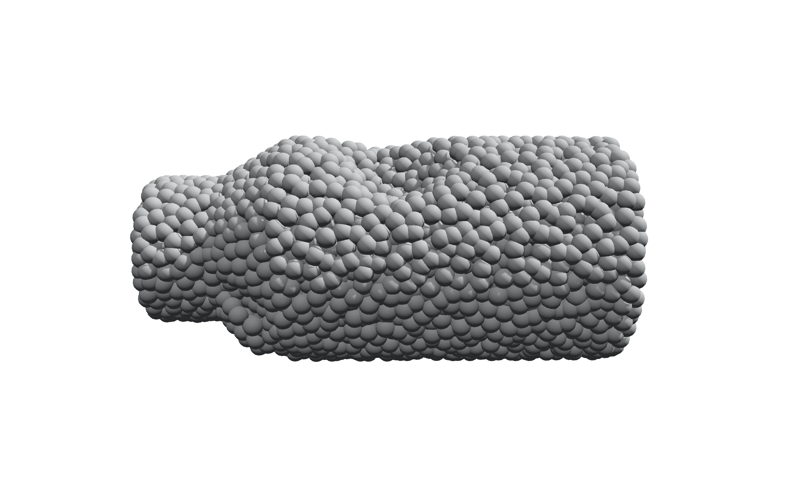
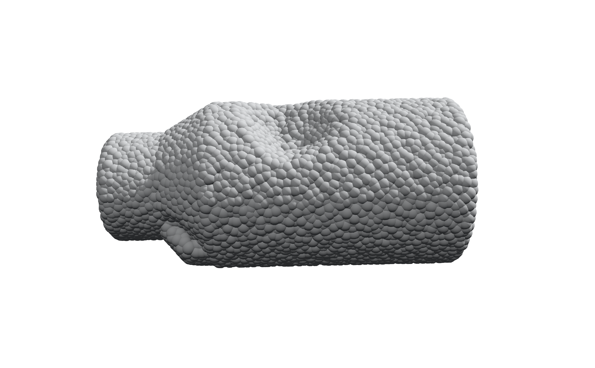

# Point Cloud Bead Renderer

Render point clouds as shaded 3D beads in your browser. Bead Lab is a static,
single-page viewer built with Three.js, with controls for lighting, materials,
camera position, and PNG export. `index.html` is the project page (this
overview, with a live example gallery); `beed_lab.html` is the viewer itself.

| `examples/sample_pcd_3000.ply` (3,000 vertices) | `examples/sample_pcd_10000.ply` (10,000 vertices) |
| --- | --- |
|  |  |

Both renders were produced by loading the matching example file into Bead Lab
with default studio lighting; see [Use your own point cloud](#use-your-own-point-cloud).

## Quick start

Open `beed_lab.html` in a desktop browser with WebGL support. Internet access
is required to load Three.js r128 from cdnjs; there is no build or package
install. `index.html` is a static project page that links to it and is not
the viewer itself.

Alternatively, serve the repository locally with Python 3:

```sh
python3 -m http.server 8000 --bind 127.0.0.1
```

Then visit <http://localhost:8000/beed_lab.html>. The viewer starts with a
built-in sample.

## Use your own point cloud

1. Click **load .ply file**, or drag a PLY file onto the view.
2. Drag to orbit and scroll to zoom. Use **Object Rotation** to rotate the
   cloud independently of the camera and lighting.
3. Adjust bead size, roughness, light, shadows, and normal tint.
4. Set a file name and click **save png** to export the current canvas view.

Try `examples/sample_pcd_3000.ply` first, then import
`examples/sample_bead_preset.json` using **import .json** or drag and drop.
`examples/sample_pcd_10000.ply` provides a denser example of the same shape.
The renders above are reference output for these two files; actual appearance
and resolution depend on your settings and browser viewport.

Presets save appearance and camera settings, **not point coordinates**. Load
the PLY separately before applying a preset for an imported cloud. Generated
shapes use randomness, so a preset does not reproduce their exact coordinates.

## Features

- Built-in sample and cylinder, stepped cylinder, sphere, torus, and box generators.
- Instanced sphere rendering with adjustable bead size and tessellation.
- Directional lighting, shadows, optional ground plane, and background colors.
- Surface-normal tint estimated from neighboring points.
- Camera controls, object rotation, and automatic orbit.
- PNG downloads and JSON preset import, export, and clipboard copy.

## Supported input and limitations

- Input is **PLY**, not the PCL `.pcd` format. Only vertex positions are used;
  input colors, normals, faces, and other attributes are ignored.
- The current parser expects a vertex-first PLY with scalar vertex properties
  and an LF-terminated header. ASCII and binary little-/big-endian files are
  supported; binary `x`, `y`, and `z` must be `float` or `double` (including
  `float32`/`float64` aliases). List-valued vertex properties are unsupported.
- Clouds are centered and scaled for viewing; this is not a measurement tool.
- Loading and normal estimation run on the main thread. Large clouds or high
  tessellation can pause the interface and use substantial GPU memory. Start
  with the 3,000-point example and increase complexity gradually.
- PNG export uses the current canvas resolution. There is no batch renderer
  or Python rendering CLI in this repository.

Selected PLY and preset files are read in the browser with `FileReader`; the
application has no upload backend. Loading the page makes a network request
to cdnjs for Three.js. Offline use requires a local copy of that dependency
and an updated script URL.

## Repository layout

```text
index.html                     Project page: overview and example gallery
beed_lab.html                  Viewer, styles, and application code
examples/                      Example PLY files and a JSON preset
docs/images/                   Reference PNG renders, tied to the examples above
LICENSE                        MIT license
```

## Development and hosting

Edit `beed_lab.html` and reload the browser; no build step is required. Before
submitting a change, check the built-in sample, both example PLY files, preset
import/export, camera controls, and PNG export, and inspect the browser console
for errors. Include the browser and reproduction steps when reporting a bug.
`index.html` (the project page) can be edited independently.

The repository can be served by any static host. For GitHub Pages, configure
deployment from the repository root in the repository's Pages settings; the
root `index.html` becomes the site's landing page automatically.

## License

[MIT](LICENSE). Three.js is a separate, MIT-licensed dependency loaded from
cdnjs; see [third-party notices](THIRD_PARTY_NOTICES.md).
